<div align="center">

<picture>
  <source media="(prefers-color-scheme: dark)" srcset="assets/dark.svg">
  <source media="(prefers-color-scheme: light)" srcset="assets/light.svg">
  
</picture>

<br>

[](https://git.io/typing-svg)

</div>

<br>

## About Me

I'm a backend engineer working out of Pune, India, currently a **Senior Analyst @ Accenture**, where I build and operate Java microservices and the GCP-based data pipelines that feed them. My day-to-day sits at the intersection of two things: keeping distributed backend systems fast and predictable under load, and moving data reliably through cloud pipelines that other teams depend on.

- 🔭 Currently building scalable Java microservices and cloud-native data platforms
- ☁️ Working across BigQuery, Dataflow, Pub/Sub, and Cloud Spanner for large-scale data movement
- ⚙️ Focused on backend performance, service reliability, and clean distributed-systems design
- 📍 Based in Pune, India
- 📫 Reach me at **pritamdhoke3@gmail.com**

<br>

## Experience

```
$ cat experience.log

[Accenture Solutions Pvt. Ltd.]   Senior Analyst / Full Stack Software Engineer
                                  Java · Spring Boot · Microservices · GCP Data Pipelines
                                  Pune, India

[Cognizant Technology Solutions]  Software Engineer
                                  Hyderabad, India

> 3+ years building production backend systems and cloud data infrastructure
```

<br>

## Tech Stack

<div align="center">

**Backend**


**Cloud & Data**


**Platform & Tooling**


</div>

<br>

## Certifications

```
$ ./verify-cert.sh --provider aws

[####################################] 100%

✔ AWS Certified Cloud Practitioner
  issued-by: Amazon Web Services
  status:    verified
```

<br>

## GitHub Stats

<div align="center">


</div>

<div align="center">

### Trophies


</div>

<br>

## Featured Projects

<table>
<tr>
<td width="50%" valign="top">

### 🧩 CDP Studio
Data quality engine built on GCP, handling large-scale validation across BigQuery pipelines feeding downstream analytics.

`Java` `Spring Boot` `BigQuery` `Dataflow` `Cloud Spanner`

</td>
<td width="50%" valign="top">

### 📦 OC360 File Upload Service
GCS-backed file upload architecture for a Spring Boot product, designed around resumable uploads and clean storage boundaries.

`Spring Boot` `Google Cloud Storage` `Microservices`

</td>
</tr>
</table>

<br>

## Connect With Me

<div align="center">

[](https://www.linkedin.com/pritamdhoke3)
[](https://github.com/pritam3)
[](mailto:pritamdhoke3@gmail.com)

</div>

<br>

<div align="center">


</div>

<br>

<div align="center">

</div>
